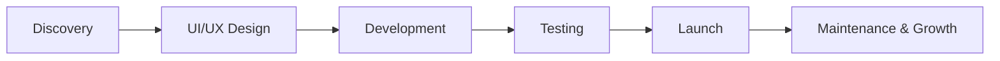

<div align="center">

# ⚓ Digital Wharf

### Premium Software Agency for Web, Mobile & AI Solutions


<br/>

**Building high-performing websites, scalable applications, and AI-powered digital products for ambitious brands.**

<br/>

<a href="https://www.digitalwharf.com">
  
</a>
<a href="mailto:digitalwharf.co@gmail.com">
  
</a>

</div>

---

## What We Build

We help startups, businesses, and growing brands launch digital products that look premium, perform fast, and scale with confidence.

| Service | What You Get |
|---|---|
| Custom Website Development | Premium, responsive, conversion-focused websites |
| Web Application Development | Scalable dashboards, portals, SaaS platforms, and internal tools |
| Mobile App Development | Cross-platform mobile apps with clean UI and reliable performance |
| UI/UX Design | Modern interfaces designed for clarity, trust, and conversion |
| AI Solutions | AI-powered features, automation, chatbots, and workflow tools |
| Performance Optimization | Faster loading, better structure, and stronger user experience |

---

## Tech Stack

<div align="center">

### Frontend  


### Backend  


### Mobile & DevOps  


</div>

---

## Why Digital Wharf

```text
Clean Design        → Premium visual experience
Scalable Code       → Built for long-term growth
Fast Performance    → Better UX and stronger conversion
Reliable Delivery   → Clear process, clean execution
Business Focus      → We build for outcomes, not just screens
```

---

## Our Development Standard



---

## Featured Focus Areas

- Conversion-focused business websites  
- Landing pages for campaigns and launches  
- SaaS dashboards and admin panels  
- Booking, CRM, ERP, and internal systems  
- Mobile apps for startups and service businesses  
- AI automation and smart workflow tools  

---

<div align="center">

## Work With Us

Have a project in mind? Let’s build something sharp, fast, and scalable.

<a href="https://www.digitalwharf.com">
  
</a>

<br/><br/>

**Digital Wharf**  
Software Agency | Web Development | Mobile Apps | AI Solutions  

</div>
